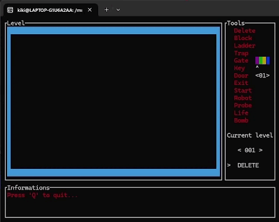
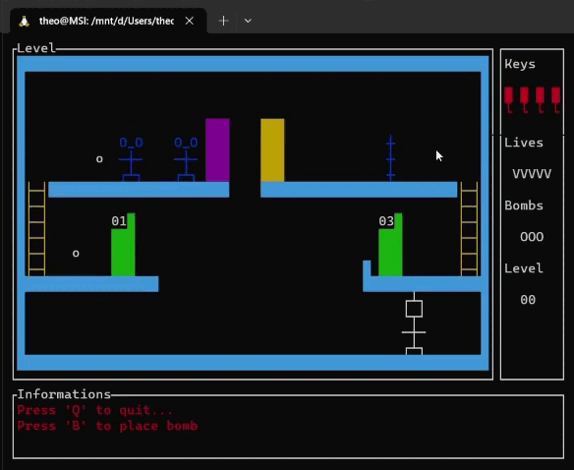
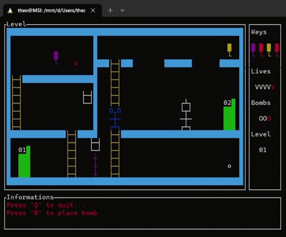
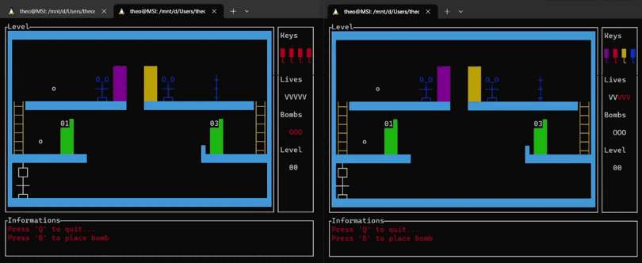

# Rocket Space Invaders

Rocket Space Invaders est un projet réalisé dans le cadre de notre 3e année de [licence informatique](https://licenceinfo.fr) à l'[Université de Reims Champagne-Ardenne](https://www.univ-reims.fr), qui consiste à créer un jeu multi-joueurs en réseau et multi-threadé.


## Prérequis
- Être sous [Linux](https://www.linux.org) ou sur [WSL](https://learn.microsoft.com/fr-fr/windows/wsl/install)

- Installer la [bibliothèque ncurses](https://manpages.debian.org/stretch/ncurses-doc/ncurses.3ncurses.en.html) grace à la commande suivante (*sous Ubuntu*)
    ```bash
    sudo apt-get install libncurses-dev
    ```

## Compilation

Vous devez vous positionner dans le dossier `Code` et faire la commande suivante dans le terminal.
```bash
make
```

## Lancement des programmes

Une fois le projet compilé, en étant dans le dossier `Code`, vous pouvez lancer le programme de votre choix.
- Le programme *`editeur.c`* correspond à l'éditeur, il permet de créer/modifier des maps.
- Le programme *`serveur.c`* correspond au serveur, il permet de gérer les parties et doit être lancer __avant les clients__.
- Le programme *`client.c`* correspond au client, il doit être lancé après que le serveur soit actif pour que le joueur puisse jouer.
    <br/><br/>

    ### Éditeur
    ```bash
    ./bin/editeur NOM_FICHIER
    ```
    Avec NOM_FICHIER qui est le nom du fichier binaire contenant le map (Exemple : `./bin/editeur map1.bin`)

    ### Serveur
    ```bash
    ./bin/serveur
    ```


    ### Client
    ```bash
    ./bin/client IP_SERVEUR NUMERO_PORT
    ```
    Avec `IP_SERVEUR` qui est l'adresse IP du serveur et `NUMERO_PORT` qui est le numéro de port de la socket UDP.

    Pour tester directement : 
    ```bash
    ./bin/client 127.0.0.1 12345
    ```

## Outils disponibles et règle du jeu
La liste des outils présents dans l'éditeur, ainsi que la règle du jeu et l'explication complète du projet, sont disponibles dans le rapport : [Rapport](Rapport_DRV_SNT.pdf)


## Éditeur


## Jeu
**Mourir :**



**Utilisation des bombes :**



**Winner :**



## Contact
- DARVILLE Killian (killian.darville@etudiant.univ-reims.fr)
- SINET Théo (theo.sinet@etudiant.univ-reims.fr)


## Licence
Copyright © 2023, [Rocket Industries]().